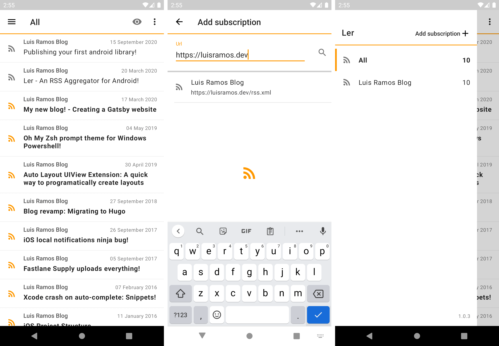

I have been working on a RSS aggregator app called _Ler_. Its available for Android, and you should [give it a try!](https://play.google.com/store/apps/details?id=app.luisramos.ler) It is the first app I design, develop and publish all by myself, so I am pretty proud of that!

I know what you are thinking, _another_ RSS feed app? Aren't there billions of them? Well, yes. But this one is mine. And I have plans. Big plans! Let me tell you how it came to be, and what I want to do with it.

### Twitter is a time sink

I spend too much time on twitter. I checked my phone usage settings for apps, and twitter is always number one on the list, toppling YouTube (!!) and WhatsApp. I though I watched a lot of YouTube, but apparently, on a very boring day, I accumulated _4 hours_ of twitter usage...

So I looked into Googles digital well-being app, and turned on a 30 minute timeout for Twitter. And it works! Some days, I don't even reach the timeout. Unfortunately, this also meant that a lot of the blogs I read wouldn't reach me as well.

And there you have it. I took the time I was wasting and built this app!

### Ler

The app name is the portuguese word for _reading_. I did a search and it seems nobody claimed it, so why not? The main features that I have built so far:

- You can subscribe to RSS feeds (crazy I know). You can manually type in a website address, or you can share from the browser to the app!
- You can filter out articles that you already read, or just show articles from one feed.
- You can swipe an article to toggle it read, or mark all articles in a feed at once!
- Feeds will be checked for updates every hour auto-magically.

Articles currently open in the browser. I toyed with the idea of having a built in reader, but that seemed overkill for what I wanted to do. I already used the browser to do most of my reading anyway.

I am pretty proud of how it turned out, despite not being great at UI design, I kept it simple and it does the job! I have been using it for the past couple of weeks, and I think I impressed myself by actually using it instead of defaulting to Twitter as a time killer.

### Open so everyone can _read_ it

Not only am I using this app to avoid using twitter all the time, I will also use it as a showcase project. Hence, my plan in the next weeks is to write a bunch of tests, clean up the folder structure, and open source it.

So far, I have not worked in an app that had their source open, so most often when talking about my work I can't provide examples. I applied all my knowledge and tried to build the simplest app I could, while still being a good example of how I would build an app.

My plan is to also write about android development, while using the app as an example. I made some architecture choices that I can talk about, since I haven't found a lot of written examples online.

Please give it a spin, and let me know what you think! You can [tweet at me](https://twitter.com/luisramos1337) or send me an [email](mailto:luis.ramos@hey.com?subject=Ler Feedback). I have a little roadmap with more features, but let me know if you want a particular feature added, and I will add it to the list!
