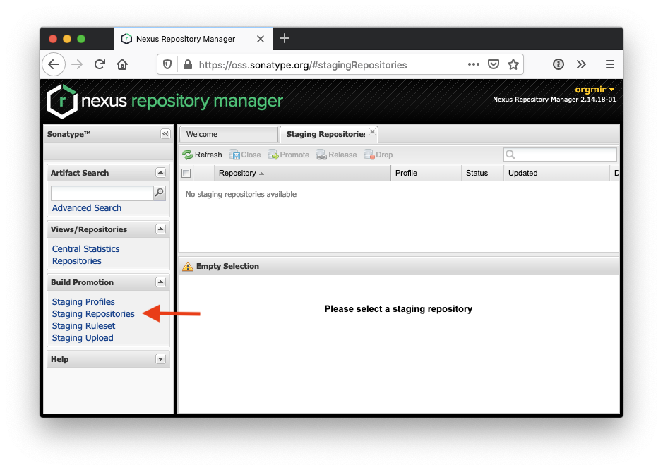

Publishing a library you develop is a journey on its own. It can be overwhelming, specialy if you are targeting Android. There is a lot of documentation out here, but I could not find one that would go end to end with it. So I wrote this post!

This came about because I released my first open source library: [Kroclin]! It is a snapshot testing library written in Kotlin, to help out writing less code in your tests. Check it out and give it a star if would like. Now, let me tell you about the journey to release it!

Sonatype provides a [guide for OSS repository hosting](ossrh-guide) and [another one for releasing your deployment](oss-releasing) that I read, but they could be more helpful. Everything you need to know is there, it just takes several readings and lots of googling to grok it. Here are the steps you need to go through:

First, [create a Sonatype JIRA account](https://issues.sonatype.org/) if you don't have one already.

Then [create a new project issue](https://issues.sonatype.org/secure/CreateIssue.jspa?issuetype=21&pid=10134). Make sure to click this link, since they require that you use the template. In the issue body, write that you want to claim the domain that matches the library `groupId`. In the case of my library, the `groupId` is `dev.luisramos.kroclin` and I claimed `dev.luisramos.*`. Here is [my JIRA ticket](jira-ticket) as an example.

I picked up from reading other issues that you only need to go through this process once, if you request a wildcard `groupId`. Other libraries released under the same `groupId` don't require a new project ticket to be created.

Note that you could also claim the `groupId` that matches your project hosting, for example, `io.github.orgmir` if that's where your project lives.

After you have opened a new project ticket, you need to prove that you own the domain you claimed. You can either:

1. Add a TXT record to your DNS referencing the url to the JIRA ticket you created (fastest)
2. Setup a redirect to your github page

I went with the first option, and since every DNS provider differs I won't go into specifics. Some googling on how to add a TXT record for your DNS provider should get you there.

<strong>NOTE:</strong> You will need to submit the full URL for the issue, so in my case the content for the TXT record was <a href="https://issues.sonatype.org/browse/OSSRH-60527"><i>https://issues.sonatype.org/browse/OSSRH-60527</i></a>.

I went ahead and added a comment on the ticket with the output of `dig -t TXT luisramos.dev`, just to show that it was working. Don't know if it made a difference 😅

After doing the proof of domain ownership, you will need to wait for Sonatype to reply to your ticket. They will let you know once the repository on their end is ready to receive artifacts. Don't actually upload anything until they give you the OK, your artifacts will just end up in a generic catch-all repository.

After they reply, go ahead and upload your first artifact. You can copy my [`gradle-mvn-push.gradle`](https://github.com/Orgmir/kroclin/blob/main/gradle/gradle-mvn-push.gradle) script and run `./gradlew clean build uploadArchives` (don't worry, I also copied it from [someone else](https://github.com/JakeWharton/wormhole/blob/master/gradle/gradle-mvn-push.gradle)). You could also use a plugin like [vanniktech/gradle-maven-publish-plugin](https://github.com/vanniktech/gradle-maven-publish-plugin).

Once the upload is done, go ahead and log in to https://oss.sonatype.org using your Sonatype JIRA account.

Select `Staging Repositories` on the side bar, and you should see a list with the repository for your library. Select the repo, and press `Close` on the top bar. This will perform some validation on Sonatype's side, and once the status updates and the repository is tagged as closed, select the repository again and press `Release`.

If you use a plugin, the upload step will probably try to close and release the staging repository. Loggin in to Nexus Repository Manager should only be needed when you are releasing for the first time, or if you use a script like me.

You can now update on your JIRA ticket that the repository has been released. This will let Sonatype know, and they will trigger a sync with maven central, so your library can show when searching in [search.maven.org](https://search.maven.org). This step should is also only needed the first time you are releasing.

And that's it! It might take a couple of hours for the sync to happen, but congratulations! You have released a library onto the world! What a trip it was 🚀

[kroclin]: https://github.com/orgmir/kroclin
[ossrh-guide]: https://central.sonatype.org/pages/ossrh-guide.html
[oss-releasing]: https://central.sonatype.org/pages/releasing-the-deployment.html
[jira-ticket]: https://issues.sonatype.org/browse/OSSRH-60527
