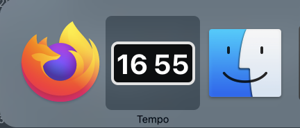

I wrote a little clock for my macOS dock! SwiftUI version!



Here's the `AppDelegate`:

```swift
@NSApplicationMain
class AppDelegate: NSObject, NSApplicationDelegate {

    let clockView = ClockView()
    lazy var hostingView = NSHostingView(rootView: clockView)
    let dateFormatter = DateFormatter()

    func applicationDidFinishLaunching(_ aNotification: Notification) {
        dateFormatter.dateFormat = "HH mm"

        NSApp.dockTile.contentView = hostingView
        NSApp.dockTile.display()

        updateClock()

        Timer.scheduledTimer(
            timeInterval: 1,
            target: self,
            selector: #selector(updateClock),
            userInfo: nil,
            repeats: true)
    }

    @objc func updateClock() {
        let timeString = dateFormatter.string(from: Date())
        if (clockView.state.timeString != timeString) {
            clockView.state.timeString = timeString
            DispatchQueue.main.async {
                NSApp.dockTile.display()
            }
        }
    }
}
```

And here's the view!

```swift
class ClockState: ObservableObject {
    @Published var timeString = "09 41"
}

struct ClockView: View {
    @ObservedObject var state = ClockState()

    var body: some View {
        Text(state.timeString)
            .font(Font.system(size: 40).bold())
            .foregroundColor(.white)
            .padding(6)
            .background(RoundedRectangle(cornerRadius: 8))
            .overlay(
                RoundedRectangle(cornerRadius: 8)
                    .stroke(Color(hue: 0.85, saturation: 0, brightness: 0.9), lineWidth: 4)
            )
    }
}

```