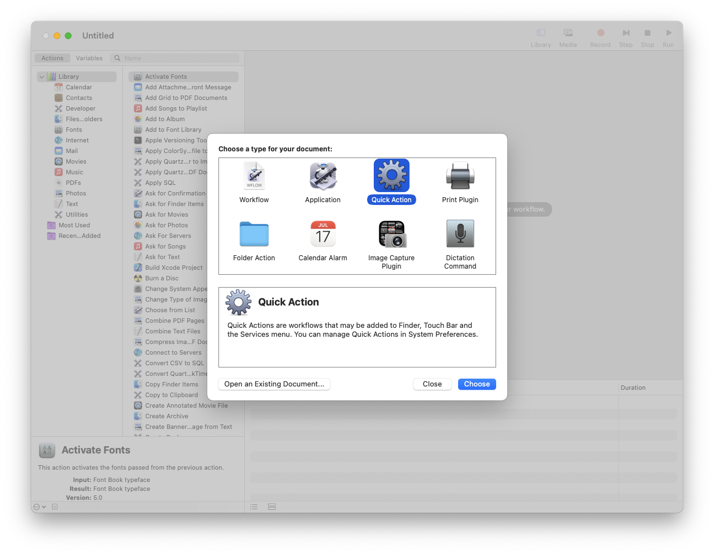
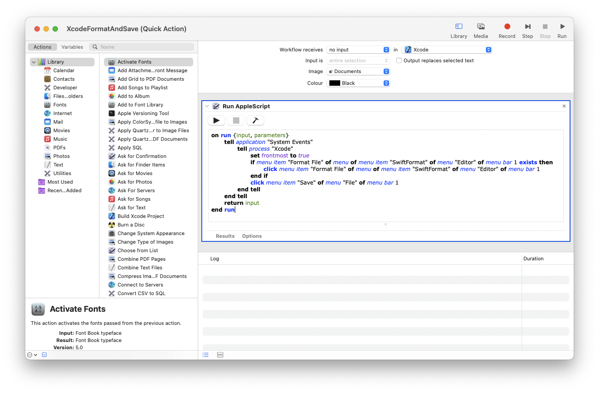
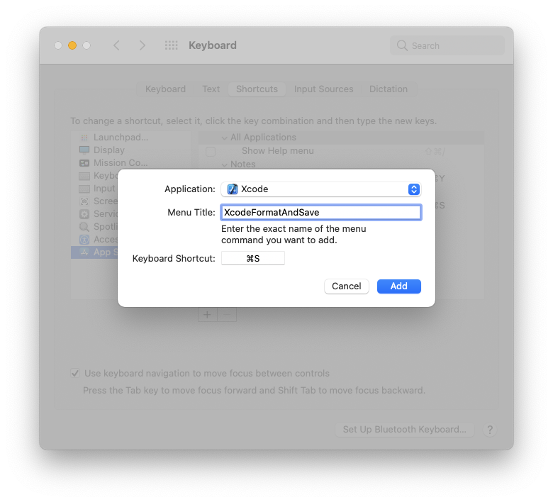
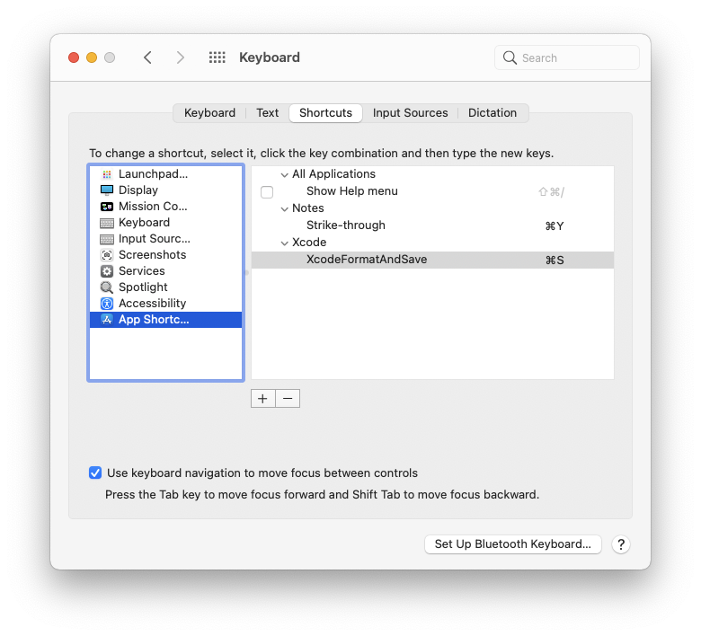
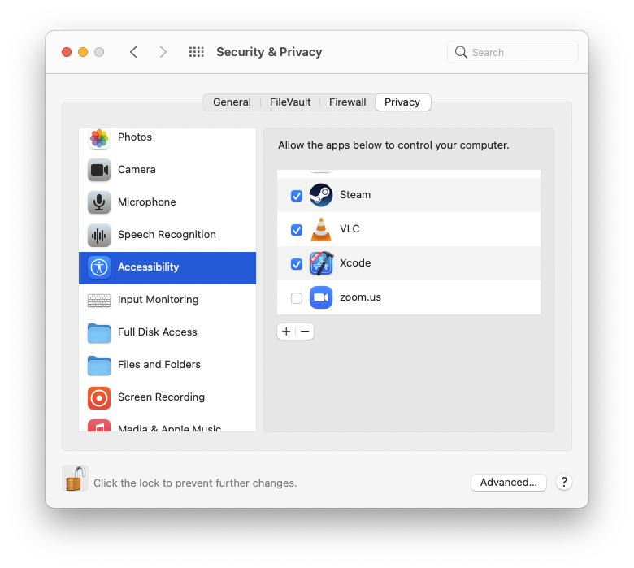

Lost are the days where we could modify and extend Xcode to do our bidding (RIP Alcatraz). We have some room to work with source editor extensions, but adding a macro that formats our Swift code and then saves the file is out of reach. Or is it?

Via a weird combination of the [SwiftFormat](https://github.com/nicklockwood/SwiftFormat) source editor extension, Automator, and Keyboard shortcuts I can now format and save my file by pressing the blessed Cmd+S shortcut.

Here is how it works:

## Step 1: setup SwiftFormat

If you use `brew` like me, run these commands to install SwiftFormat. Otherwise, check their [Github page](https://github.com/nicklockwood/SwiftFormat#command-line-tool) for installation instructions.

```bash
brew install swiftformat
brew install --cask swiftformat-for-xcode
open "/Applications/SwiftFormat For Xcode.app"
```

Last command will open the "SwiftFormat For Xcode" app, so it can install the source editor extension. Don't forget to also restart Xcode.

This extension will place a menu item that formats our file, under "Editor" > "SwiftFormat" > "Format File". This is important for our next step!

## Step 2: automate with Automator

Open up the lovely Automator, and create a Quick Action.



Next add a "Run AppleScript" action, and paste in the following code:

```applescript
on run {input, parameters}
	tell application "System Events"
		tell process "Xcode"
			set frontmost to true
			if menu item "Format File" of menu of menu item "SwiftFormat" of menu "Editor" of menu bar 1 exists then
				click menu item "Format File" of menu of menu item "SwiftFormat" of menu "Editor" of menu bar 1
			end if
			click menu item "Save" of menu "File" of menu bar 1
		end tell
	end tell
	return input
end run
```

The script will do the following:

1. Check to see if "SwiftFormat" > "Format File" menu item exists in Xcode
2. If it does exist then click "Format File", otherwise do nothing
3. Click "Save"

Here is how the Quick Action looks. I've changed the "Workflow receives" to "no input" and "in" to "Xcode".



Save the Quick Action. Automator will place it directly into a macOS "Services" folder, and that will make it available in the "Xcode" > "Services" menu.

This action requires access to "Accessibility" permissions. If you try to run it via Automator you will probably get a permission related error. We will address this further down the post!

And there you go! A Format and Save macro. Now the last step:

## Step 3: Add a Keyboard shortcut

Go to "System Preferences" > "Keyboard" and pick the "Shortcuts" tab. On the sidebar, select "App Shortcuts". Add a new shortcut, the "Application" is XCode, the "Menu Title" is the name of our Quick Action (in my case XcodeFormatAndSave), and the "Keyboard Shortcut" is Cmd+S!





And there you go! If you go to Xcode and try to save a Swift file, it will run SwiftFormat before it saves.

Actually, it will probably throw an error. This action needs "Accessibility" permissions, so you will need to navigate to "System Preferences" > "Security & Privacy" and give permission to Xcode.



Now you can let Xcode take care of the formatting. You are welcome!
