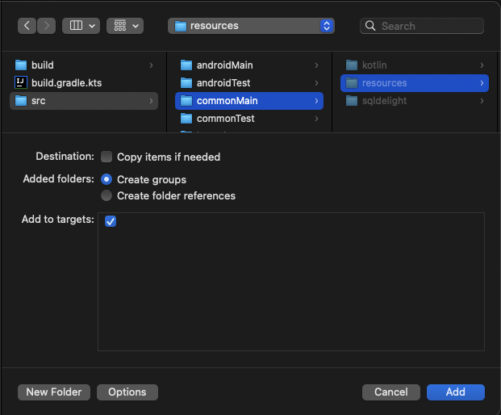

Building a mobile application will sooner or later put you in a position of bundling resource files. In the Kotlin Multiplatform Mobile world, this is still somewhat of a problem. I have a JSON file with some data I want to bundle in iOS and Android and in this post I will show you of a way to do it with a bit of configuration and some helper code.

## Resources folder

The multiplatform shared library already has a structure folder for resources, so I’ve placed the json file in the `src/commonMain/resources` folder.

The shared resources folder will not be added automatically to the Android library so add this to the shared android library `build.gradle`:

```kotlin
android {
    // ...
    sourceSets["main"].resources.setSrcDirs(
        listOf(
            "src/androidMain/resources",
            "src/commonMain/resources" // <-- add the commonMain Resources
        )
    )
}
```

Now the files in that folder will be bundled in the library and available in the Android app!

But what about iOS? Well, the solution I have is a bit awkward but it works! Add the `src/commonMain/resources` folder to the Xcode project. You can either drag it in, or right click where you want it and select "Add Files to...". Make sure to deselect "Copy items if needed", select "Create groups", and add them to the targets you need.



A drawback of this is that we will need to add new resource files manually in Xcode. We can’t use a reference folder since we need those files to be individually added in the “Copy Bundle Resources” step. But I think this is totally worth it, since in my experience we spend more time editing the existing resources than creating new ones.

<div class="blockquote info">
   If you have a lot of resources you need to add, maybe you could look into a Run Script step that does that work!
</div>

Now how do we access the resources at runtime?

## Access the resources

To read the resources, create a `ResourceReader` class with actual implementations for iOS and Android:

```kotlin
 expect class ResourceReader {
    fun readResource(name: String): String
}

// Android resources are available via the class loader
actual class ResourceReader {
    actual fun readResource(name: String): String =
        javaClass.classLoader!!.getResourceAsStream(name).use { stream ->
            InputStreamReader(stream).use { reader ->
                reader.readText()
            }
        }
}

// Kotlin/Native resources will be in the Bundle!
actual class ResourceReader {
    private val bundle: NSBundle = NSBundle.bundleForClass(BundleMarker)

    actual fun readResource(name: String): String {
        val (filename, type) = when (val lastPeriodIndex = name.lastIndexOf('.')) {
            0 -> {
                null to name.drop(1)
            }
            in 1..Int.MAX_VALUE -> {
                name.take(lastPeriodIndex) to name.drop(lastPeriodIndex + 1)
            }
            else -> {
                name to null
            }
        }
        val path = bundle.pathForResource(filename, type) ?: error(
            "Couldn't get path of $name (parsed as: ${listOfNotNull(filename,type).joinToString(".")})"
        )

        return memScoped {
            val errorPtr = alloc<ObjCObjectVar<NSError?>>()

            NSString.stringWithContentsOfFile(
                path,
                encoding = NSUTF8StringEncoding,
                error = errorPtr.ptr
            ) ?: run {
                error("Couldn't load resource: $name. Error: ${errorPtr.value?.localizedDescription} - ${errorPtr.value}")
            }
        }
    }

    private class BundleMarker : NSObject() {
        companion object : NSObjectMeta()
    }
}
```

These implementations are from the [DroidconKotlin repo](https://github.dev/touchlab/DroidconKotlin), which I recommend you take a look at because it has a lot of cool solutions for common KMM problems.

## Wrap up

To read the files, call `ResourceReader().readResource("timezones.json")` and you will get a string with the contents of the file.

With the resources always in the same folder (with the small caveat of having to manually add new files in Xcode) you will have an easier time managing them and making them work for you across both platforms.

While researching for this post, I found the [moko-resources](https://github.com/icerockdev/moko-resources) library but it is way to opinionated for my use case and it does much more than I needed. Also, if you are looking to share resources across multiplaform tests for your shared library [this blog post by Victoria](https://developer.squareup.com/blog/kotlin-multiplatform-shared-test-resources/) has a really nice solution that I used for my testing setup.
